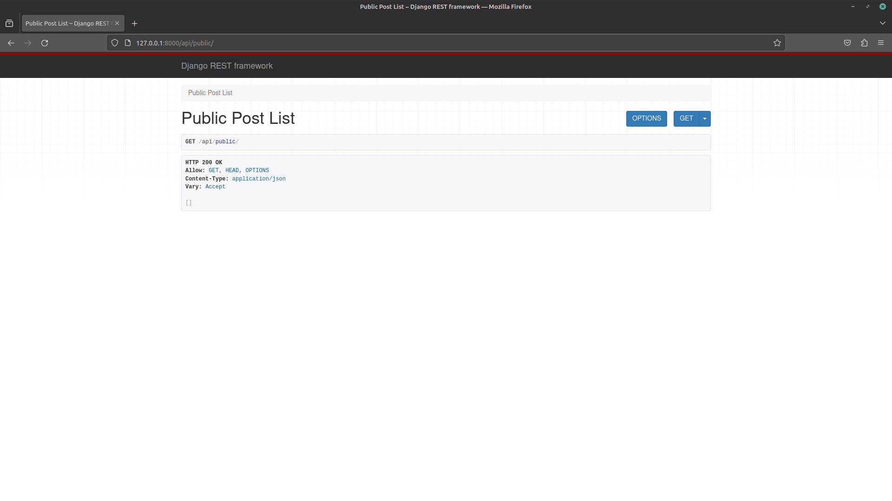

# Django Rest Readme

## i. Steps and Explanations

### Step 1: Install Django REST Framework

Run the following command to install Django REST Framework:

```bash
pip install djangorestframework
```

### Step 2: Add DRF to INSTALLED_APPS

Add 'rest_framework' to the `INSTALLED_APPS` in your `settings.py`:

```python
INSTALLED_APPS = [
    # other apps
    'rest_framework',
]
```

### Step 3: Update Permission Model in settings.py

Add the following configuration to your `settings.py`:

```python
REST_FRAMEWORK = {
    'DEFAULT_PERMISSION_CLASSES': [
        'rest_framework.permissions.AllowAny',
    ],
}
```

### Step 4: Create serializers.py

Create a file named `serializers.py` inside your app directory with the following content:

```python
# serializers.py

from rest_framework import serializers
from blog import models

class PostSerializers(serializers.ModelSerializer):
    class Meta:
        model = models.Post
        fields = ("posted_by_id", "message")
```

### Step 5: Define the API view in apiviews.py

Create a file named `apiviews.py` inside your app directory with the following content:

```python
# apiviews.py

from rest_framework.views import APIView
from rest_framework.response import Response
from blog import models
from .serializers import PostSerializers

class PublicPostList(APIView):
    def get(self, request):
        msgs = models.Post.objects.public_posts()[:5]
        data = PostSerializers(msgs, many=True).data
        return Response(data)
```

### Step 6: Update urls.py

Open your app's `urls.py` file and add the following path:

```python
# urls.py

from django.urls import path
from .apiviews import PublicPostList

urlpatterns = [
    # other paths
    path("api/public", PublicPostList.as_view(), name="api_public"),
]
```

### Step 7: Test your API

Run your Django development server:

```bash
python manage.py runserver
```

Visit http://127.0.0.1:8000/api/public/ in your browser or using a tool like curl or Postman to ensure your API is working correctly.

### Step 8: Update README file

Replace the following placeholders with your actual answers:

#### i. Screenshots


